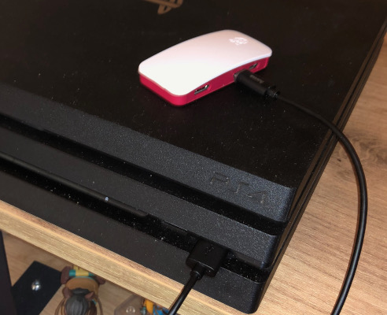

What's the matter
=================

This software allows you to alter the Dualshock inputs before they
reach the PS4. It can be used to remap or disable buttons, reverse or
swap analog pads, and/or add `gyro aiming
<http://gyrowiki.jibbsmart.com/>`_ to a game that doesn't support it
natively.

.. note:: This has only be tested with the latest model of Dual Shock
          4 (product ID 0x09cc) and will probably not work with other
          models.

What you'll need
================

Hardware
--------

Arduino setup
#############

There are two possible setups. The first one uses an `Arduino Leonardo
<https://store.arduino.cc/arduino-leonardo-with-headers>`_
microcontroller equipped with a USB 2.0 Host Shield and works through
USB, so you will need to plug the Dualshock to the Leonardo using an
USB cable.

.. image:: ../images/cables.jpg
   :align: center

"1" goes to the Dual Shock and "2" goes to the PS4, or the PC when
you're configuring. There is no need for an external power supply.

Cons:

  * The cables...

.. note:: There are several vendors who sell USB host shields for
          Arduino. Beware of some chinese no-name boards which come
          with severe manufacturing defaults (I had to add solder to
          make one work).

Full list of hardware:

  * Arduino Leonardo
  * USB 2.0 Host Shield
  * Two micro-USB to USB-A cables
  * (optional) a USB-A extender if the cable is too short for you

Raspberry Pi setup
##################

The second setup uses a `Raspberry Pi Zero W
<https://www.raspberrypi.org/products/raspberry-pi-zero-w/>`_. The
Dualshock communicates with the RPi through Bluetooth, and the RPi
with the PS4 through USB.

Pros:

  * No cables, at least from the Dualshock.

Cons:

  * You need Wifi so the software can "speak" to the RPi
  * In order to support this using Linux FunctionFS, the kernel has to
    be patched. The patch is included as
    src/rpi0/kernel-patch.diff. So if you want to build your own OS
    image you'll have to rebuild the kernel as well. Pre-prepared
    images are available through the desktop app.

Full list of hardware:

  * Raspberry Pi Zero W
  * 4Gb micro-SD card
  * Two micro-USB to USB-A cables

Software
--------

The desktop application, used to cook up your remapping configurations
and transmit them to your device of choice, runs on Linux, Windows and
mac OS. You can download the binaries for your platform on `Github
<https://github.com/fraca7/dsremap/releases>`_.

.. warning:: The mac OS application is not signed, so you will have to
             bypass mac OS security restrictions the first time you
             launch it, by right-clicking the app and choose "Open",
             then confirming.
