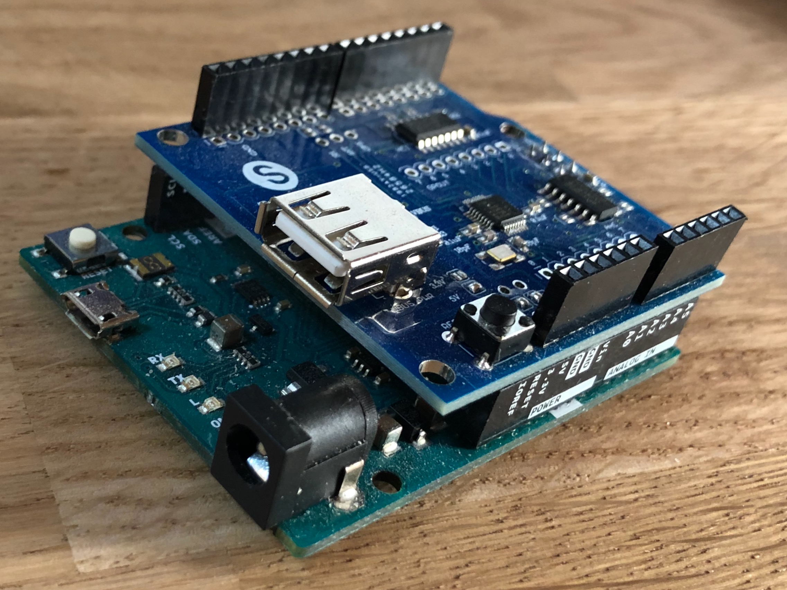
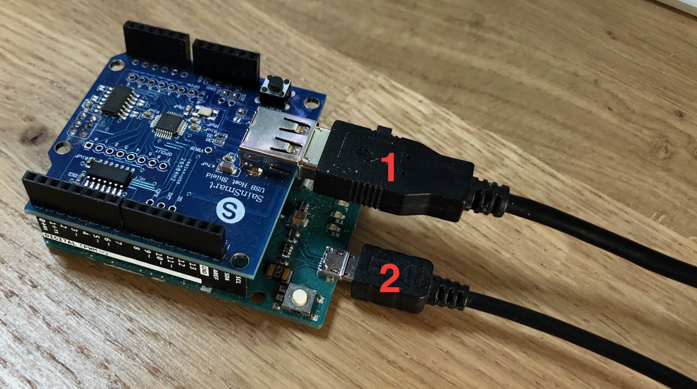

What's the matter
=================

Using this software in combination with a specific Arduino setup allows you to alter on the fly the input of a Dual Shock before it reaches the PS4. This can be used to remap buttons, reverse analog pads, or implement gyro aiming even for games that don't support it "natively".

.. note:: This has only be tested with the latest model of Dual Shock 4 (product ID 0x09cc) and will probably not work with other models.

What is needed
==============

Hardware
--------

Obviously, a PS4 and a Dual Shock 4 controller. But also an Arduino Leonardo equipped with a USB 2.0 host shield. The end result looks like this, cables omitted:

Software
--------

The desktop application, used to program the Leonardo, runs on Linux, Windows and mac OS.

.. warning:: The mac OS application is not signed, so you will have to bypass mac OS security restrictions the first time you launch it, by right-clicking the app and choose "Open", then confirming.

Cables everywhere
=================

For various reasons Bluetooth is not supported, so you'll have to plug the Arduino to the PS4 through the native USB, then the Dual Shock through the USB host shield, like this:

"1" goes to the Dual Shock and "2" goes to the PS4, or the PC when you're configuring. There is no need for an external power supply.
