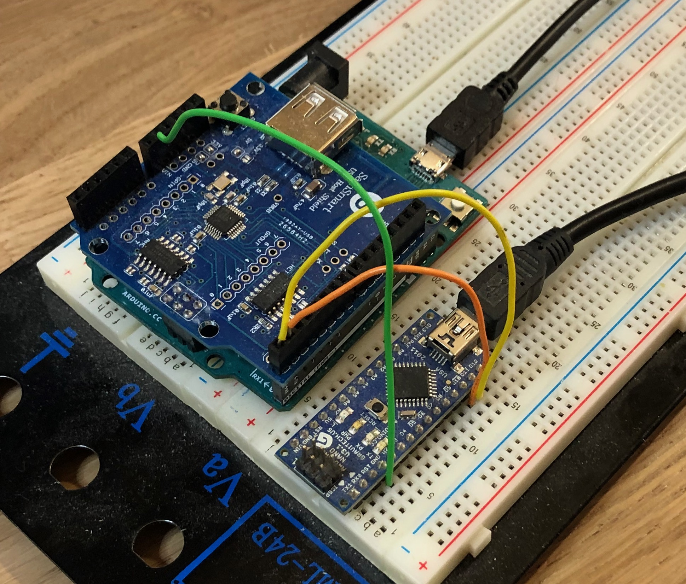
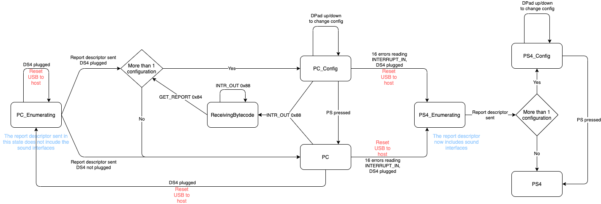

Code structure
==============

Arduino sketch
--------------

The Arduino code is in `src/dsremap`. Most files contain the definition/implementation for a single class.

  * `DS4USB`: This class is responsible for handling communication with the DualShock. It uses the USB Host Shield Library's HDIUniversal class.
  * `Host`: This class is responsible for handling communication with the host (PC or PS4) and contains most of the logic. This uses LUFA.
  * `BytecodeWriter`: Handles writing bytecode to the EEPROM.
  * `Descriptors.[h,cpp]`: USB descriptors and LUFA callbacks
  * `IMUIntegrator`: Computes current angles from raw IMU data.
  * `Blink`: Handles LED blinks
  * `Log`: Logging subsystem; more on that later
  * `Configuration`: Class that holds a full configuration (collection of VMs and programs)
  * `VM`: Virtual machine to interpret the bytecode

On the Arduino side, the code basically acts as a MitM between the PS4 and DualShock. When an input report is received from the DualShock, it passes through a series of programs that may change it, before being sent to the PS4. Those programs take the form of bytecode that is interpreted by the VM class. They're stored in EEPROM and are grouped in so-called "Configurations". A single configuration may be active at any time.

Bytecode is uploaded to the board by the desktop application, using HID SET_REPORTs. The desktop application contains a compiler for a language that vaguely resembles C++; all builtin programs (gyro aiming, invert axis, etc) are written in this language and compiled on the fly.

Log system
##########

In order to avoid taking up too much memory, the logging system uses integer message IDs instead of strings. Mapping from those IDs to actual strings are stored in the `messages.txt` file. From this two files are generated as part of the build process:

  * `messages.h`: A set of #define to associate the message ID to the corresponding number
  * `strings.pickle`: In the tools/ subdirectory, associating those numbers to the actual string message

Log methods take a variable number of arguments. Those, along with the message ID, are sent over `Serial1`, packed in a binary format. You can change this and the baud rate in `Config.h`. On the PC side, the `tools/logs.py` script reads those binary messages, and prints the associated string, formatted with the arguments.

To read those logs you will typically need a serial -> USB conversion; I use an Arduino Nano with software serial for this:

The sketch for the Nano just reads from software serial on pins 10/11 and echoes this back to its own serial-USB connection for the PC to pick up.

Host type discovery
###################

The problem is the following: the USB descriptor we send to the PS4 **must** include the 3 sound interfaces, or the device won't be aknowledged. Those interfaces are not actually implemented because

  1. It's a pain in the ass
  2. There's not enough program memory left for this on a Leonardo

But the PS4 does not care. On the other hand mac OS (at least) does care and resets the connection after trying to setup the sound interfaces. So in order to work with both the PS4 and PCs the sketch has to somehow detect the type of host. *Host.cpp* implements a FSA which handles this, as well as other stuff like going into "upload bytecode" mode and choosing the configuration, as illustrated in the following diagram:

We start by assuming the host is a PC, and send a report descriptor without the sound interfaces. In this case we'll start seeing read errors on the interrupt IN channel. After 16 of them (to account for random errors) we assume the host is, indeed, a PS4 and restart the whole enumeration stuff, knowing we need to send the full USB descriptor.

If more than one configurations are stored in the EEPROM we also handle up/down DPad events to choose which one will become active; feedback is provided through the builtin LED. Pressing PS ends the configuration state.

Note that the PS4_Enumerating state can only be reached if the DualShock is plugged, or we wouldn't know what to answer to the initial requests from the PS4.

Desktop app
-----------

The desktop app is written in Python, using PyQt5. The code should be pretty self-explanatory (at least simpler than the Arduino code IMO, if you exclude the compiler stuff); here is the overall structure of the `dsrlib` package (in `src/dsrlib`):

  * `compiler`: everything needed to compile a program to its bytecode. If you want to hack this you'd better know what you're doing. The main thing that is still missing here is an optimization pass; the generated code contains many unnecessary temporary variables, common subexpressions are not handled, etc.
  * `domain`: Domain objects and persistence, as well as utility functions for HID enumeration and communication
  * `ui`: Actual UI code.
