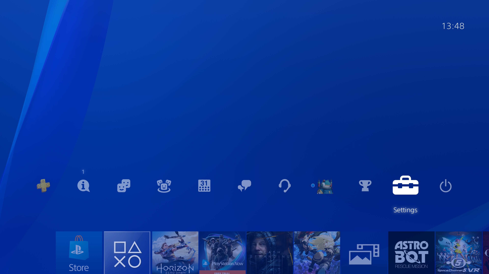
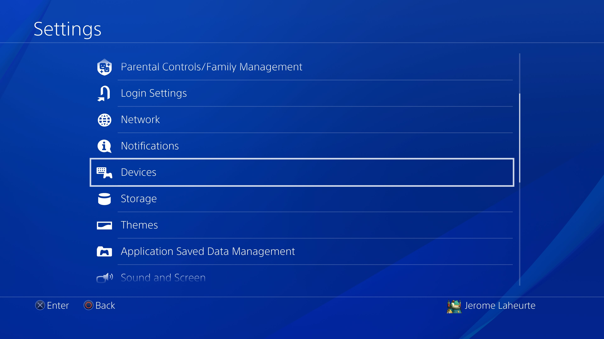
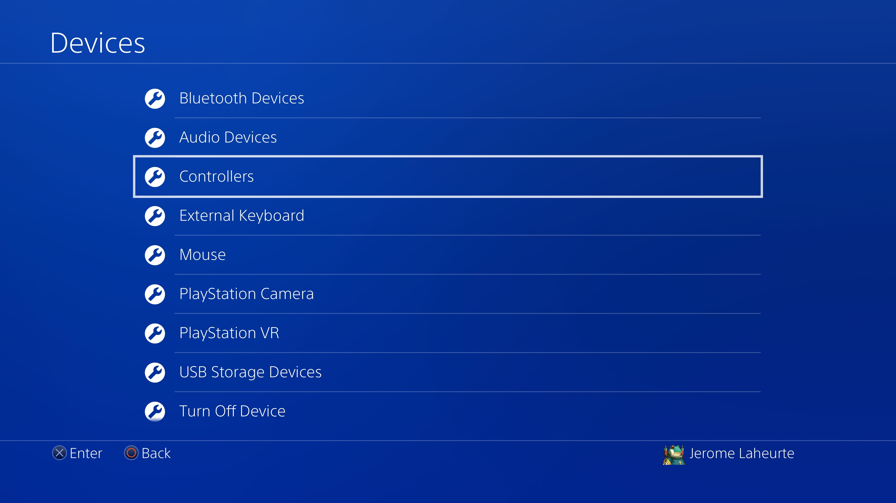
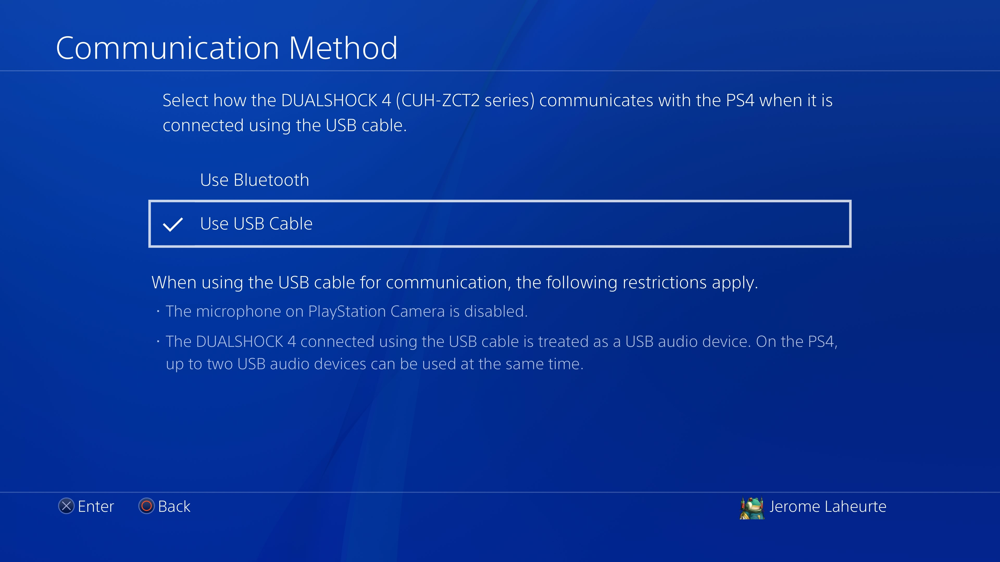

PS4 configuration
=================

By default, the PS4 only communicates with the Dual Shock through Bluetooth, even when it's plugged directly through USB. To have it use USB for communication, which is a prerequesite for this to work, you must turn on the right option. First go to Settings:

Choose "Devices":

Then "Controllers":

Then "Communication method":

.. image:: ../images/PS4-04.jpg
   :align: center

And select "Use USB Cable":

This will have no effect on "regular" use, i.e. you can always use a controller through Bluetooth as before.
