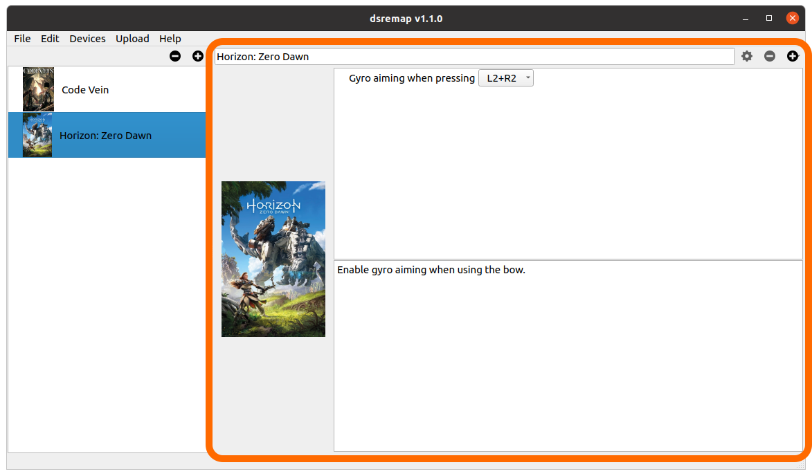

Configurations
==============

Main UI
-------

The main window is split horizontally in two main areas.

The left area is a list of available configurations. The two buttons
above can be used to delete the selected configuration, or add a new
one.

.. note:: Almost everything you do in the UI can be undone using Edit
          -> Undo or Ctrl-Z (Cmd-Z on mac OS).

And the right area holds the details of the currently selected
configuration. You can change its name, change the thumbnail by
dropping an image on the current one, and add or remove so-called
"actions", which are rules for altering the Dual Shock inputs.

Uploading configurations
------------------------

Once you're done creating your configurations, they must be uploaded to the Arduino. First, make sure to check the checkboxes in the configuration list, for the ones you want to upload. Then plug in your Arduino to your PC and select "Upload configurations to", then your device, from the Upload menu.

.. note:: If the menu says "No device detected", try to unplug the Arduino and plug it again.

Now you're ready to plug the whole shebang to your PS4.

Configuration choice on the device
##################################

Only one configuration may be active at a time once the system is plugged to the PS4. If you uploaded several ones, you'll have to choose which one will be active after plugging the Dual Shock and **before** pressing PS. The Arduino builtin LED will blink to indicate the currently selected configuration.

Configuration #1 selected:

.. raw:: html

   <video controls="1"><source src="_static/blink1.mp4" type="video/mp4" /></video>

Use `up` and `down` on the DPad to change it, then press PS to confirm.

Configuration #2 selected:

.. raw:: html

   <video controls="1"><source src="_static/blink2.mp4" type="video/mp4" /></video>
