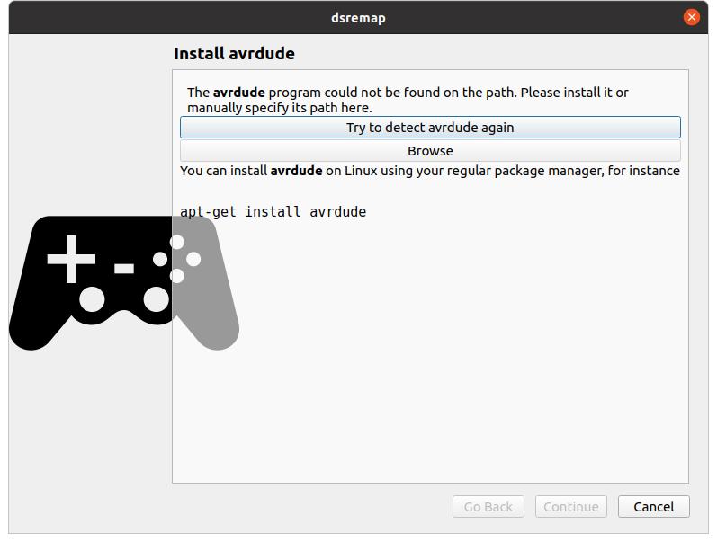
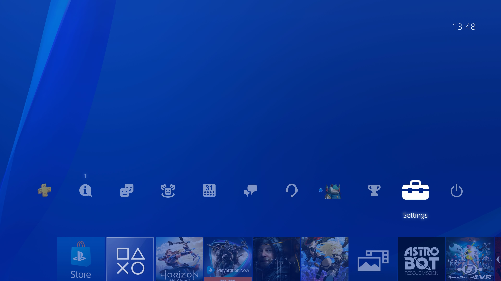

Setup (Leonardo)
================

Once you have your Leonardo, the first thing to do is to upload the
firmware to it. The first time you launch the desktop application, a
wizard should appear to help you in this process. Later you can do
this by selecting "Update Arduino firmware" from the "Devices" menu.

.. note:: The initial image file is not distributed with the
          application, so the wizard will first download it. It's
          about 74Kb.

At this point you're probably still missing the external tool used to
program the Arduino (except on Linux, where it is embedded in the
AppImage), so the first page of the wizard will point this out.

On mac OS, the less painful way to install avrdude is through Homebrew_. On Windows, I use WinAVR_.

.. _Homebrew: https://brew.sh
.. _WinAVR: https://sourceforge.net/projects/winavr/

Once this tool is installed, click the "Try to detect avrdude again" button and the wizard should proceed. Follow the onscreen instructions until the end.

.. _PS4Setup:

PS4 configuration
-----------------

This only applies if you're using the Arduino Leonardo based setup.

By default, the PS4 only communicates with the Dual Shock through
Bluetooth, even when it's plugged directly through USB. To have it use
USB for communication, which is a prerequesite for this to work, you
must turn on the right option. First go to Settings:

Choose "Devices":

.. image:: ../images/PS4-02.jpg
   :align: center

Then "Controllers":

.. image:: ../images/PS4-03.jpg
   :align: center

Then "Communication method":

.. image:: ../images/PS4-04.jpg
   :align: center

And select "Use USB Cable":

.. image:: ../images/PS4-05.jpg
   :align: center

This will have no effect on "regular" use, i.e. you can always use a
controller through Bluetooth as before.
