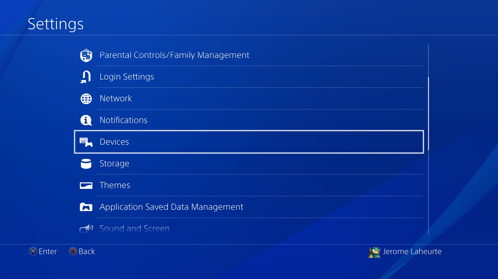
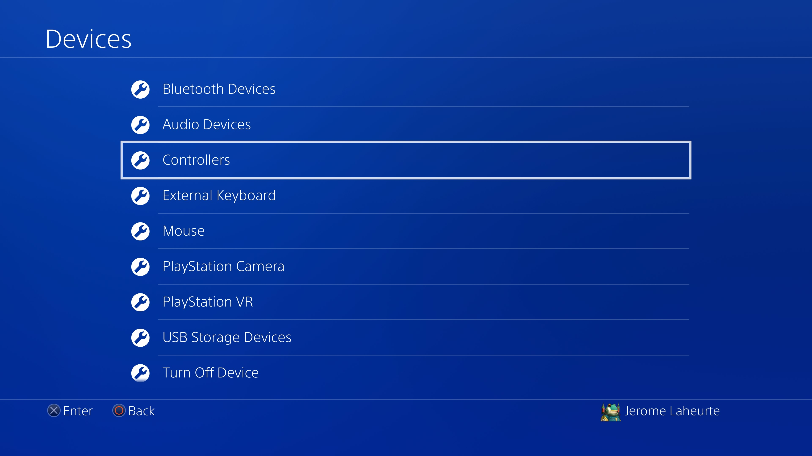
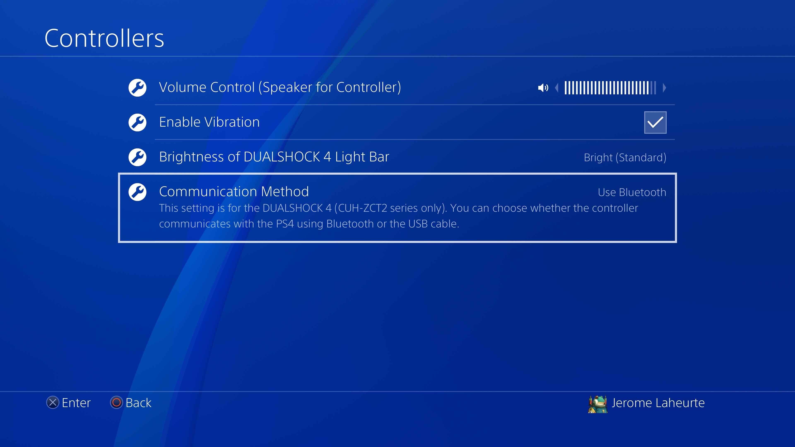
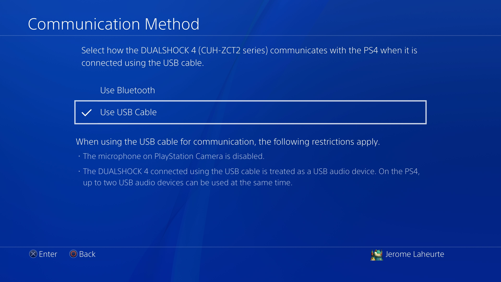

.. _PS4Setup:

PS4 configuration
=================

By default the PS4 will only communicate with a controller through
Bluetooth, even when it's plugged in the USB port. In order for
everything to work you need to configure it to actually use USB. First
go to Settings:

.. image:: ../images/PS4-01.jpg
   :align: center

Choose "Devices":

Then "Controllers":

Then "Communication method":

And select "Use USB Cable":

This will have no effect on "regular" use, i.e. you can always use a
controller through Bluetooth as before.
