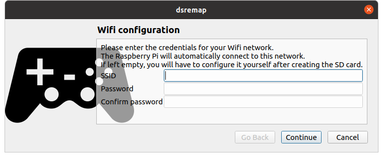
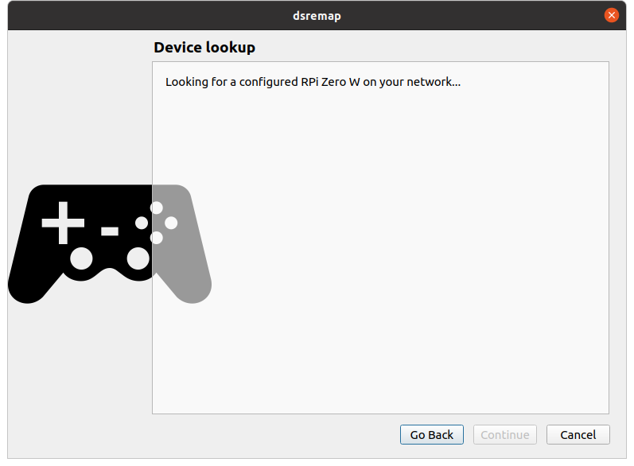

Setup (RPi)
===========

With the Raspberry Pi, you'll need a micro-SD card (4Gb minimum). The
first step is to burn the operating system image on this card. The
first time you launch the desktop application, a wizard will help you
set this up. Later you can create a new image by selecting "Setup a
new SD card for the RPi Zero W" from the "Devices" menu.

.. note:: The initial image file is not distributed with the
          application, so the wizard will first download it. It's
          about 640Kb.

The wizard will first ask you for your Wifi credentials. Those
credentials will be added to the disk image, so if you ever change
your Wifi SSID or password you'll have to create a new SD card.

The image file will then be copied to your Downloads directory. You
can the use the `Raspberry Pi OS imager
<https://www.raspberrypi.org/software/>`_ to burn it to your SD card
(select the "Custom image" option).

Initial setup wizard and pairing
--------------------------------

During the initial setup, the wizard will proceed with the pairing
process. After burning the SD card, insert it in your Raspberry Pi and
power it up. Put it near your PS4 because the pairing process will ask
you to plug it to the PS4 using a second micro-USB to USB-A cable.

When you'll press Next in the wizard, it will wait until the RPi has
fully booted. The detection should be automatic. The first boot may
take some time, so just be patient until the process is over.

Then follow the instructions to pair your Dualshock controller with the
RPi (and the RPi to the PS4).

Once a Dualshock is paired this way, it can only work through the RPi
proxy. If you want to pair it back directly to your PS4, just plug the
Dualshock directly to the console, just as you had to do the very
first time you used the controller.

You can pair a Dualshock later using the "Devices" menu.
